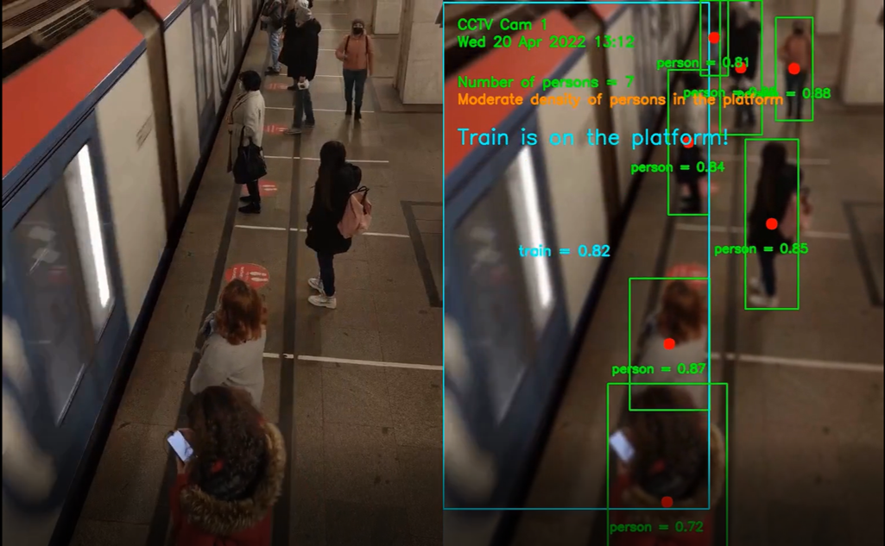

# Computer Vision Train Station demo

This is an example of a computer vision application to detect the presence of a train on a platform and to count the number of people on the platform.
This usecase can be useful for public transportation for passengers crowd counting.
We are going to use YoloV5 to detect persons and train. Results will be saved into an Azure ML experiment. We can use different versions of YoloV5 with PyTorch.

We can blur the frames from the video for people privacy concerns. There are many ways to do it. In this example we will blur all the frames without degrading the quality of the images for the CV model. We can as well decide to blur only the detected faces (and not the full image).

20-April-2022

Serge Retkowsky | serge.retkowsky@microsoft.com | https://www.linkedin.com/in/serger/

Note: All these Python notebooks were made for demo purposes. They were not designed for production usage. This feature is currently in public preview. This preview version is provided without a service-level agreement. Certain features might not be supported or might have constrained capabilities. For more information, see Supplemental Terms of Use for Microsoft Azure Previews. https://azure.microsoft.com/en-us/support/legal/preview-supplemental-terms/
